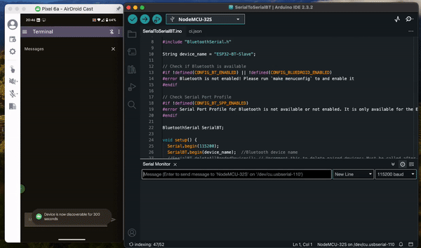

# Bluetooth Chat
# Android Esp32 BluetoothChat App 📱
This Android app connects to an ESP-32 microcontroller via Classical Bluetooth (SPP) and facilitates message exchange. The ESP-32 acts as a bridge between serial communication and Bluetooth, sending and receiving data as byte streams. This project highlights the use of Jetpack Compose for the UI, Dagger Hilt for dependency injection, and Kotlin Coroutines with StateFlow to handle asynchronous operations and state management.

![kotlin] ![Jetpack] ![apiLevel]

## Table of Contents

* [Overview](#bluetooth-chat)
* [Features](#features)
* [Demo](#demo)
* [Setup](#setup)
* [How It Works](#how-it-works)
* [Design Patterns & Architecture](#design-patterns--architecture)
* [Tech Stack](#tech-stack)
* [Contributing](#contributing)


## Features

  * [ESP-32 Bluetooth Communication](): Connect to an ESP-32 via Classical Bluetooth (SPP).
  * [Serial Data Transfer](): Send and receive serial data as byte streams.
  * [Device Discovery](): Scan for nearby Bluetooth devices.
  * [Real-Time Messaging](): Exchange messages between Android and ESP-32.
  * [Jetpack Compose UI](): Modern, declarative UI with Compose.
  * [Dagger Hilt for DI](): Simplifies dependency injection in Android.
  * [Kotlin Coroutines & StateFlow](): Manage asynchronous data flow and state updates.
  * [MVVM & Clean Architecture](): Maintainable, scalable, and testable code structure.

## Demo
<div style="display: flex; align: center;">
    
</div>

## Android Build

> compileSdk 34 <br>
> minSdk 26 <br>
> targetSdk 34 <br>
> Java version 17

    
## Permissions    
   ```XML
   <uses-permission android:name="android.permission.BLUETOOTH" android:maxSdkVersion="30"/>
    <uses-permission android:name="android.permission.BLUETOOTH_SCAN" android:usesPermissionFlags="neverForLocation"
        tools:targetApi="s" />
    <uses-permission android:name="android.permission.BLUETOOTH_ADMIN" />
    <uses-permission android:name="android.permission.BLUETOOTH_CONNECT" />
    <uses-permission
        android:name="android.permission.ACCESS_FINE_LOCATION"
        tools:ignore="CoarseFineLocation" />
    <uses-feature android:name="android.hardware.bluetooth" />
   ```


## Setup

To run this project, follow these steps:

### ESP 32 setup
Arduino IDE was used to program ESP 32 microcontroller
1. find the right port and esp controller model in the IDE
2. insert the folloing code
   ```c
   #include "BluetoothSerial.h"

   String device_name = "ESP32-BT-Slave";

   // Check if Bluetooth is available
   #if !defined(CONFIG_BT_ENABLED) || !defined(CONFIG_BLUEDROID_ENABLED)
   #error Bluetooth is not enabled! Please run `make menuconfig` to and enable it
   #endif

   // Check Serial Port Profile
   #if !defined(CONFIG_BT_SPP_ENABLED)
   #error Serial Port Profile for Bluetooth is not available or not enabled. It is only available for the ESP32 chip.
   #endif

   BluetoothSerial SerialBT;

   void setup() {
     Serial.begin(115200);
     SerialBT.begin(device_name);  //Bluetooth device name
     //SerialBT.deleteAllBondedDevices(); // Uncomment this to delete paired devices; Must be called after begin
     Serial.printf("The device with name \"%s\" is started.\nNow you can pair it with Bluetooth!\n", device_name.c_str());
   }

   void loop() {
     if (Serial.available()) {
     SerialBT.write(Serial.read());
   }
   if (SerialBT.available()) {
     Serial.write(SerialBT.read());
   }
   delay(20);
   }
   ```
3. Upload the code to the microcontroller

### Android app Setup
1. Clone the repository:
```bash
git clone https://github.com/your-username/esp32-bluetooth-chat-app.git
```
2. Open the project in Android Studio.
3. Build the project:
   * Ensure the required SDK versions are installed.
   * The app targets Android SDK 34 and uses Kotlin 1.5.1. and Java version 17
4. Run the app:
   * Install the app on your Android device.
   * Ensure Bluetooth is enabled.
   * Use the app to scan for and connect to your ESP-32 device.


## How It Works

1. Bluetooth Communication with ESP-32:
   * The app uses BluetoothAdapter to discover and connect to the ESP-32, which is programmed to function as a Serial Port Profile (SPP) device.
   * The ESP-32 acts as a bridge between Bluetooth and Serial Communication, allowing the app to send and receive messages as byte streams.
     ```kotlin
        val bluetoothAdapter: BluetoothAdapter? = BluetoothAdapter.getDefaultAdapter()
        val device: BluetoothDevice = bluetoothAdapter.getRemoteDevice(deviceAddress)
        val socket = device.createRfcommSocketToServiceRecord(uuid)
     ```

2. Serial Communication:
    * The ESP-32 transmits and receives data from the Android device in the form of character bytes over the Bluetooth SPP channel.
  
3. Jetpack Compose for UI:
    * The UI is built with Jetpack Compose, following a declarative paradigm. The UI is reactive and automatically updates based on the state exposed by the ViewModel using StateFlow and MutableState.
    * Example UI Code (Compose):
    ```kotlin
    val state by viewModel.state.collectAsState()
    ```
    ```Kotlin
    @Composable
    fun ChatScreen(
        state: BluetoothUiState,
        onDisconnect:()-> Unit,
        onSendMessage:(String)->Unit
    ){
        var message by rememberSaveable {
        mutableStateOf("")
    }
    
    val keyboardController = LocalSoftwareKeyboardController.current
    
    Column(
        modifier = Modifier.fillMaxSize()
    ) {
        Row(
            modifier = Modifier
                .fillMaxWidth()
                .padding(16.dp),
            verticalAlignment = Alignment.CenterVertically
        ) {
            Text(text = "Messages", modifier = Modifier.weight(1f))
            IconButton(onClick = onDisconnect) {
                Icon(imageVector = Icons.Default.Close, contentDescription = "Disconnect")
            }
        }

        LazyColumn(
            modifier = Modifier
                .fillMaxWidth()
                .weight(1f),
            contentPadding = PaddingValues(16.dp),
            verticalArrangement = Arrangement.spacedBy(16.dp)
        ) {
            items(state.messages){ message->
                Column(
                    modifier = Modifier.fillMaxWidth()
                ) {
                    ChatMessage(
                        message = message, 
                        modifier = Modifier.align(
                            if (message.isFromLocalUser) Alignment.End else Alignment.Start
                        )
                    )
                }
            }
        }
        
            Row(
                modifier = Modifier
                    .fillMaxWidth()
                    .padding(16.dp),
                verticalAlignment = Alignment.CenterVertically
            ) {
                TextField(
                    value = message,
                    onValueChange = {message = it},
                    modifier = Modifier.weight(1f),
                    enabled = state.isConnected,
                    placeholder = {
                        Text(text = "Message")
                    } )

                IconButton(
                    onClick = {
                        onSendMessage(message)
                        message = ""
                        keyboardController?.hide()
                    },
                    enabled = state.isConnected,
                ) {
                    Icon(imageVector = Icons.AutoMirrored.Default.Send , contentDescription = "send message")
                }
            }
        }
    }
    ```
5. Coroutines & StateFlow for Asynchronous Data Handling:
    * Coroutines are used to handle background tasks such as device scanning, pairing, and message transfers asynchronously, ensuring a smooth user experience without blocking the main thread.
    * StateFlow is used to manage and observe UI state changes (e.g., message updates), allowing Compose to reactively update the UI based on the flow of data.
      
    ```kotlin
    data class BluetoothUiState(
        val scannedDevices: List<BluetoothDeviceDomain> = emptyList(),
        val pairedDevices: List<BluetoothDeviceDomain> = emptyList(),
        val isConnected:Boolean = false,
        val isConnecting:Boolean = false,
        val errMessage:String? = null,
        val messages:List<BluetoothMessage> = emptyList()
    )
    ```
    ```kotlin
    @HiltViewModel
    class BluetoothViewModel @Inject constructor(
        private val bluetoothController: BluetoothController
    ) : ViewModel() {
        private val _state = MutableStateFlow(BluetoothUiState())
        //    val state: State<CoinListState> = _state
        val state = combine(
            bluetoothController.scannedDevices,
            bluetoothController.pairedDevices,
            _state
        ){ scannedDevices, pairedDevices, state ->
            state.copy(
                scannedDevices = scannedDevices,
                pairedDevices = pairedDevices,
                messages = if(state.isConnected)  state.messages else emptyList()
            )
        }.stateIn(viewModelScope,SharingStarted.WhileSubscribed(5000),_state.value)
    }
    ```


## Design Patterns & Architecture

### MVVM (Model-View-ViewModel)

The MVVM (Model-View-ViewModel) pattern is used in this project to cleanly separate the user interface (UI) from the business logic, making the app easier to maintain and test. Here's how each layer contributes to the app:

* **Model**: Contains the data-related logic, such as device discovery and Bluetooth connection handling. This layer interacts with the Android Bluetooth Adapter API to manage Bluetooth devices and connections.
* **ViewModel**: Acts as the bridge between the Model and the View. It holds UI-related data that survives configuration changes (like screen rotations). In this app, the ViewModel manages:
  
   * Device scanning results.
The list of paired devices.
Connection statuses and messaging logic.
The ViewModel uses LiveData to expose data to the View, allowing the app to respond to changes without requiring manual updates.
   
   * View: This represents the UI, including the activities and fragments. The View observes the ViewModel for changes and updates the UI accordingly. It doesn’t handle any business logic, making it easier to keep the UI layer clean and focused only on presenting the data.
This approach ensures that the app’s business logic is decoupled from the UI, which makes the code more maintainable and testable.


### Clean Architecture

The project is built following Clean Architecture principles, which helps to ensure a clear separation of concerns. Clean Architecture divides the codebase into multiple layers, allowing for a modular and scalable application. Here’s how Clean Architecture is applied in this project:

1. **Domain Layer**: This is the core of the application. It contains the business logic, including entities (such as Bluetooth device data) and use cases (e.g., "scan for devices," "connect to a device"). The domain layer is independent of any frameworks, UI, or data sources, making it reusable and testable.

2. **Data Layer**: The data layer contains repositories that implement the business logic defined in the domain layer. It manages data retrieval and communication with external systems (in this case, the Android Bluetooth Adapter API). By using repositories, the data layer abstracts away the details of the data sources, making the domain layer completely unaware of how data is fetched or stored.

3. **Presentation Layer**: This includes the ViewModels and UI components. The ViewModel communicates with the domain layer to retrieve or manipulate data and then provides this data to the UI layer. The UI layer (View) observes the ViewModel and updates itself automatically when the data changes, thanks to LiveData.


## Tech Stack

   * [**MVVM** Architecture](): Used for separating concerns between the UI and business logic.
   * [**Kotlin**](): Primary programming language.
   * [**Android Bluetooth Adapter**](): For device discovery, pairing, and message transfer.
   * [**Android Studio**](): Development environment.
   * [**Coroutines**](): For managing asynchronous Bluetooth operations.
   * [**Jetpack compose**](): UI is implement with jetpack composer.
   * [**Dagger-Hilt**](): provides a standard way for dependency injection into the application.
   * [**Bluetooth Adapter API**](): Used for Bluetooth communication.
   * [**ESP 32 microcontroller**](): Used to create a bridge between serial communication and Classical Bluetooth.
   * [**C Programming**](): Used for programming the ESP-32, allowing it to communicate with the Android app over Bluetooth and manage serial data transfer.

## Contributing

Contributions are welcome! Please feel free to submit a Pull Request or open an Issue if you find any bugs or have feature requests.


[apiLevel]: https://img.shields.io/badge/API-26+-brightgreen.svg
[kotlin]: https://img.shields.io/badge/Kotlin-purple
[Jetpack]: https://img.shields.io/badge/Jetpack-green
